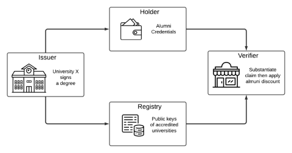

## Overview

Verifiable credentials are a new form of digital credential that offers more flexibility in authentication and authorization. They allow for proving the existence and properties of signed statements without revealing unnecessary personal information.

In this lab, you'll learn about verifiable credentials and how to build credential schemes using zero-knowledge proofs. We'll use the serverless infrastructure of Sindri, which leverages Google Cloud Platform, to automate and accelerate the process of generating zero knowledge proofs.

In particular, we will demonstrate the cryptography underpinning the top three roles in the verifiable credential diagram shown below. While a university awards a very detailed credential to any degree holder, that person may not want to share that entire credential just to recieve an alumni discount on merchandise.  With verifiable credentials powered by zero-knowledge proofs, we will walk through the machinery that lets a degree holder share an anonymized but tamper resistant proof of their claim.

NOTE: The bottom component, i.e. the registry, is generally managed by a secure ledger or blockchain.

### What you'll learn

- What verifiable credentials are and how they differ from traditional credentials
- How an issuers produce these digital credentials
- How a verifiable credential is transformed into a verifiable presentation via zero-knowledge proofs
- How to verify the presentation

### Prerequisites

- Basic understanding of cryptography concepts
- Familiarity with JSON and command-line interfaces
