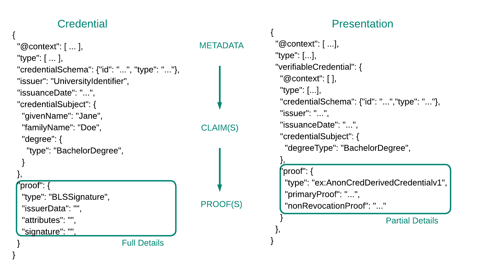

## Understanding Verifiable Credentials

Verifiable credentials are a standardized way of expressing credentials in the digital world. They offer several advantages over traditional credentials:

1. They can incorporate multiple signed statements from various authorities.
2. They allow proving properties of credentials without revealing all information.
3. They can use verifiable data registries for increased accessibility and security.

While someone will possess a verifiable credential in its entirety, they will not necessarily transmit the full digital document.  Rather they will send a verifiable presentation, which only includes the bare minimum necessary from the credential. In this codelab, we will produce a zero-knowledge proof that a person was awarded a degree by a university but we will not disclose the signature on the degree.  This protects the user from some identity thief duplicating the claim and gaining access to all the same places.

Understanding the benefits of verifiable credentials is straightforward, but the standards governing them are intricate and sophisticated. The [World Wide Web Consortium](https://www.w3.org/) (W3C) faced the challenge of creating a framework that is rigid enough to enforce a universal standard while remaining adaptable to unforeseen new applications. You can find realistic examples of [credentials](https://github.com/w3c/vc-test-suite/blob/gh-pages/test/vc-data-model-1.0/input/example-009.jsonld) and [verifiable presentations](https://github.com/w3c/vc-test-suite/blob/gh-pages/test/vc-data-model-1.0/input/example-015-zkp-vp.jsonld) provided by W3C, but for this codelab we will summarize what these documents look like in the diagram below.  In later sections, we will generally adhere to the data model of verifiable credentials when it doesn't distract from the basic concepts.

